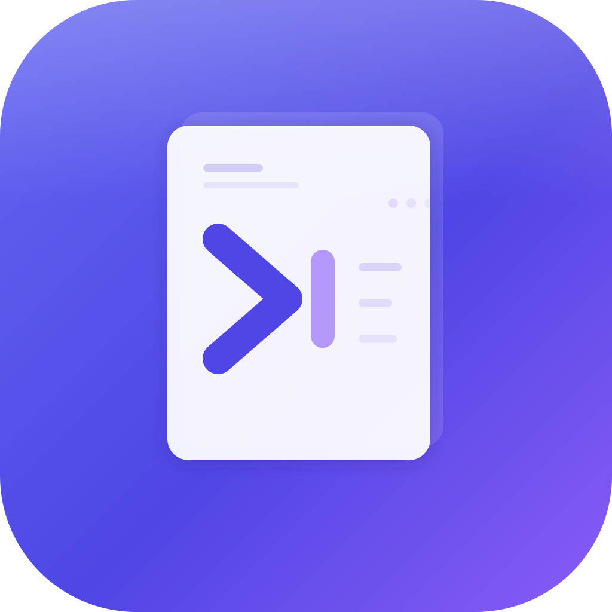

# PromptLib

**PromptLib** is a desktop application for macOS, Windows and Linux that lets you write, organize and quickly find your AI prompts in Markdown.



---

## Installation

### Download the latest version

Go to the [**Releases**](../../releases/latest) page on GitHub and download the file matching your system:

#### macOS

| File | Description |
|------|-------------|
| `promptlib-x.x.x.dmg` | macOS installer (drag to Applications) |
| `promptlib-x.x.x-arm64.zip` | ZIP archive for Apple Silicon Macs (M1/M2/M3/M4) |

#### Windows

| File | Description |
|------|-------------|
| `promptlib-x.x.x-x64.exe` | Windows installer (NSIS) |
| `promptlib-x.x.x-x64.zip` | Portable ZIP archive (no installation required) |

#### Linux

| File | Description |
|------|-------------|
| `promptlib-x.x.x-x64.AppImage` | Universal AppImage (most distributions) |
| `promptlib-x.x.x-x64.deb` | Debian/Ubuntu package |

### Install on macOS

1. Download the `.dmg` file
2. Double-click to open it
3. Drag **PromptLib** into the **Applications** folder
4. Launch the app from Launchpad or the Applications folder

> **Note**: On first launch, macOS may display a warning because the app is not signed through the Mac App Store. Go to **System Settings > Privacy & Security** and click **Open Anyway**.

### Install on Windows

1. Download the `.exe` file
2. Run the installer and follow the instructions
3. PromptLib will be available in the Start menu

> **Note**: Windows SmartScreen may display a warning because the app is not signed. Click **More info** then **Run anyway**.

### Install on Linux

**AppImage** (recommended):
1. Download the `.AppImage` file
2. Make it executable: `chmod +x promptlib-x.x.x-x64.AppImage`
3. Run it: `./promptlib-x.x.x-x64.AppImage`

**Debian/Ubuntu**:
1. Download the `.deb` file
2. Install it: `sudo dpkg -i promptlib-x.x.x-x64.deb`

---

## Features

### Prompt management

- **Create** a new prompt with the `+ New prompt` button or `Cmd+N`
- **Edit** the title by clicking on it, the content in the Markdown editor
- **Duplicate** a prompt with the `Duplicate` button or `Cmd+D`
- **Delete** a prompt with a safety confirmation
- **Copy** the Markdown content to the clipboard (`Copy` or `Cmd+Shift+C`)
- **Export** a prompt as a `.md` file
- **Import** existing `.md` or `.txt` files via the `Import .md` button

### Organization

- **Folders**: classify your prompts by category (Cmd+click on a folder to filter)
  - Create a folder with the `+` button next to "Folders"
  - Rename or delete a folder by hovering and clicking `...`
  - **Folder context**: define a shared context text for all prompts in a folder (see dedicated section below)
- **Tags**: add tags by typing in the "Add a tag..." field then pressing `Enter`
  - Remove a tag with the `x` next to it
  - Filter by tag by clicking on it in the sidebar
- **Favorites**: mark a prompt as favorite with the star. Favorites appear at the top of the list

### Folder context

**Folder context** lets you define text that will be automatically prepended to each prompt when you copy it from that folder. This is useful for sharing common instructions across a set of prompts without repeating them in each one.

**Practical example**: you have a "React" folder containing several prompts. Instead of writing "You are a React/TypeScript expert. Always use functional components." in every prompt, you define this text as the folder context. It will be automatically included with every copy.

**How to use it:**

1. Hover over a folder in the sidebar and click `...`
2. Select **Context**
3. Write your context text in the window that opens
4. Save with the **Save** button or `Cmd+Enter`

**How it works when copying:**

When you copy a prompt (via `Copy`, `Cmd+Shift+C`, or the command palette), if the prompt's folder has a defined context, the text copied to the clipboard will be:

```
[folder context]

---

[prompt content]
```

If no context is defined, only the prompt content is copied.

### Display modes

| Mode | Description |
|------|-------------|
| **Editor** | Full-screen Markdown editor |
| **Split** | Editor on the left, preview on the right (default) |
| **Preview** | Full-screen Markdown preview |

### Search

- **Sidebar search** (`Cmd+K`): filters prompts by title and tags
- **Command palette** (`Cmd+Alt+P`): global search across all prompts (title, content, tags). Works even when the app is in the background. Select a result and press `Enter` to copy the content

### Theme

Click the theme button in the status bar (bottom right) to switch between:
- **Light**: light theme
- **Dark**: dark theme
- **Auto**: follows your OS system setting

---

## Keyboard shortcuts

| Shortcut | Action |
|----------|--------|
| `Cmd+N` | New prompt |
| `Cmd+D` | Duplicate the active prompt |
| `Cmd+K` | Sidebar search |
| `Cmd+Alt+P` | Command palette (global search) |
| `Cmd+B` | Show / hide the sidebar |
| `Cmd+Shift+C` | Copy Markdown to clipboard |
| `Cmd+S` | Save (the app also saves automatically) |
| `Cmd+Shift+I` | Import Markdown files |

---

## Status bar

The bar at the bottom of the window displays:
- **Word count** of the active prompt
- **Character count** (useful for estimating tokens)
- **Folder** of the active prompt
- **Tags** of the active prompt
- **Theme button** (click to change)

---

## Data storage

Your prompts are stored locally on your machine at:

| OS | Location |
|----|----------|
| macOS | `~/Library/Application Support/PromptLib/prompts/` |
| Windows | `%APPDATA%\PromptLib\prompts\` |
| Linux | `~/.config/PromptLib/prompts/` |

Each prompt is an individual JSON file. An `index.json` file contains metadata for fast loading. No data is sent over the internet.

---

## Contributing

Contributions are welcome! If you'd like to add a feature, fix a bug, or improve the app, follow these steps:

1. **Fork** the repository
2. **Create a branch** for your feature or fix:
   ```bash
   git checkout -b feature/my-new-feature
   ```
3. **Make your changes** and commit them with clear, descriptive messages
4. **Push** your branch to your fork:
   ```bash
   git push origin feature/my-new-feature
   ```
5. **Open a Pull Request** against the `main` branch of this repository

### Pull request guidelines

- Describe **what** your PR does and **why** in the description
- Keep changes focused — one feature or fix per PR
- Make sure the project builds without errors (`npm run typecheck`)
- Follow the existing code style and conventions
- Add screenshots if your change affects the UI

Your PR will be reviewed and either approved, requested changes, or declined. Feel free to open an issue first to discuss larger changes before starting work.

---

## For developers

### Prerequisites

- Node.js >= 18
- npm

### Install dependencies

```bash
npm install
```

### Run in development mode

```bash
npm run dev
```

### TypeScript type checking

```bash
npm run typecheck
```

### Production build

```bash
npm run build
```

### Create distributable package

```bash
npm run package          # macOS (DMG + ZIP)
npm run package:win      # Windows (NSIS + ZIP)
npm run package:linux    # Linux (AppImage + deb)
npm run package:all      # All platforms
```

Files are generated in the `dist/` folder.

---

## Tech stack

| Technology | Role |
|------------|------|
| Electron | Desktop framework |
| React 19 | User interface |
| TypeScript | Static typing |
| Tailwind CSS 4 | Styling |
| CodeMirror | Markdown code editor |
| Zustand | State management |
| Fuse.js | Fuzzy search |
| Marked + DOMPurify | Secure Markdown rendering |

---

## License

ISC
